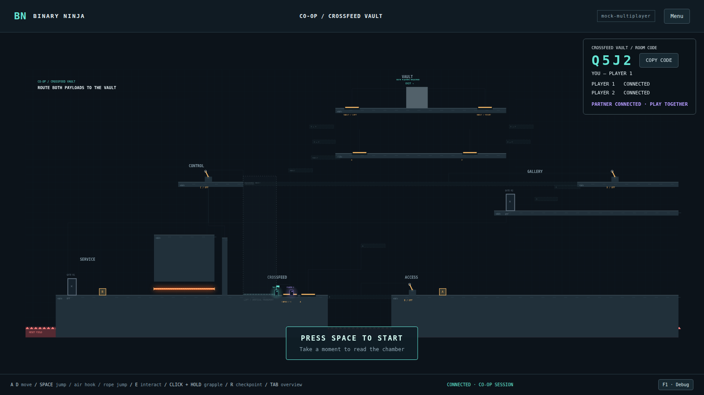

# CROSSFEED VAULT

**PROVISIONAL UNTIL HUMAN PLAYTEST ACCEPTANCE**

Room ID: `crossfeed-vault`. Starting implementation HEAD:
`33e632878594bd4de75568ed00dd7f9028856e07`.

This is the first full cooperative chamber after the mechanics were manually
accepted on two physical computers. Its objective is **ROUTE BOTH PAYLOADS TO
THE VAULT**. It is one interconnected, hand-authored 4320 × 1780 room, with
visible later destinations and permanent routes that make returning easier.
Automated completion establishes mechanical feasibility, not puzzle quality.

The controller is `mock-multiplayer` / **binary integration pending**. The
contract below may change after human playtesting. No binary, addresses,
assembly, OLLVM provenance or bogus-block evidence is generated or claimed.
The firewall is a game-authored hazard and is not binary/obfuscator evidence.

## Regions and intended solve

| Region | Authored role |
| --- | --- |
| Central floor, y=1500 | Slot-separated entry, body Plate A, cube-only Lift Cargo C |
| Right access balcony | 420-unit first gap, powered grapple anchor, B, Cube A |
| Central lift shaft | Temporary cargo power; permanent power after C |
| Upper-left control catwalk, y=750 | C and the upper shared checkpoint |
| Lower-left service bay | Cube B, R1, initially closed service door |
| Service passage | Long horizontal firewall beneath an industrial roof |
| Upper-right gallery, y=940 | R2, 190-unit boost ledge, D at y=750 |
| Vault cargo deck, y=560 | Interchangeable cube pads E and F |
| Vault crown, y=260 | Two opposite body plates and the shared exit |

1. Either player holds A. Only a player body powers the anchor. Their partner
   grapples the gap and latches B, making the return bridge permanent.
2. Retrieve Cube A from the balcony and put it on Lift Cargo C. A player body
   does not power the lift. Either player rides to the control catwalk.
3. Latch C: lift power becomes permanent, the relay powers up, the service door
   opens, and the shared checkpoint changes to upper. The other living player
   stays where they are. Cube A can now be released for the final assembly.
4. Retrieve Cube B from the service bay. A walking body fits under the beam;
   the actual overhead or resting payload overlaps it. Below the beam there are 36 units of clearance (body 34, payload 44);
   between the beam and roof there are only 42. The long roofed passage
   prevents simply jumping or pulling cargo across. Destruction returns only B to its
   service spawn. This creates the relay logistics realization.
5. Transport B through R1 to R2, carried or loose, and regroup in the gallery.
   Destination cargo leaves a bounded safe relay egress lane for later players.
6. One grounded player holds B while the partner jumps onto it and jumps again
   to D. Latching D manifests permanent return steps and the upper crossfeed
   route. Either slot may hold or climb; either accepted payload supports boost.
7. Recover A, ride the permanent lift with it, and use the upper route into the
   vault. S/down drops through code routes for a quick return to the lower
   floor; the lift and permanent bridges avoid repeating the initial crossing.
8. Put two distinct cubes on E/F in either assignment. Both final approach
   structures appear. They disappear if a cube leaves a pad; safe decks remain
   underneath. No cube is consumed.
9. Two distinct players occupy opposite final body plates while both cube pads
   remain occupied. This permanently unlocks the exit. Leave the plates and
   physically enter: one arrival is insufficient, and repeating one slot's
   arrival cannot substitute for the other.

The first-entry overview and held Tab overview reuse the existing camera.
Region silhouettes, payload A/B glyphs and authored machinery wires provide
orientation. Wires represent causal game signals, not CFG edges or CPU timing.
The UI gives an objective and short control labels, not the solution sequence.

## Provisional coordinate-free logical contract

The nine inputs are accepted body occupancy, three durable latches and per-cube
semantic contacts. The server has no coordinates or physical collision model.

| Output | Logical rule |
| --- | --- |
| `grappleAnchor` | `plateAOccupied` |
| `bridge` | `switchB` |
| `liftField` | `cubeOnLiftCargo OR switchC` |
| `relayGates` | `switchC` |
| `codePlatformA` | `switchD` |
| `codePlatformB` | `cubeOnFinalLeft AND cubeOnFinalRight` |
| exit unlock candidate | Both cube-pad inputs AND both final body-plate inputs |

`exitDoor` presents the server's durable `exitUnlocked` latch once that candidate
is accepted. B precedes C and C precedes D. Each player reports at most one body
plate at a time. Each cube has one placement; each sensor has single capacity.
Held/pulled cubes never count as resting sensor cargo. Consequently alternating
one cube or one body between final sensors cannot create simultaneous readiness.

`relayGates` also opens the authored service door. `codePlatformA` drives several
return/bridge/stair pieces, and `codePlatformB` drives both final approaches.
These are multiple physical manifestations of an output, not separate native
basic blocks. The eventual binary contract is deliberately not frozen here.

## Two named shared cubes

[ADR 0007](adr/0007-named-shared-cubes.md) extends the existing primitive per
entity. CROSSFEED defines `cubeA` and `cubeB`; accepted labs retain `cube`, and
CRUMBLE LAB has no cubes. Every cube action, transform, occupancy and denial
carries `cubeId`, checked against the room's server definition.

Each cube has an independent holder, physics authority, pull flag, epoch,
sequence, accepted transform, replica buffer, reset marker and relay cooldown.
P1 can carry A while P2 carries B. One player cannot carry/pull two cubes, although
one connected browser may simulate both loose bodies. A single local pending
action includes its cube ID. Prediction, denial, snap and destruction of A never
rewind or pause B. There is no new server-side physics or player authority.

The same generic physics handles gravity, resting support, carry/drop, grapple
pull, lift, relay, firewall reset and partner support for both payloads. Cubes
remain individual resting supports for players; loose cube-on-cube stacking is
not introduced. Only the partner's specific accepted held cube offers a local
one-way top surface. The carrier cannot collide with it, and it cannot hook,
press plates or block relay destinations. Grounded/fresh carrier requirements
and the accepted interpolation/support limitations remain unchanged.

The server keeps an explicit bounded budget of 90 messages/second with a 120
message burst, accommodating avatar + two cube streams at 20 Hz plus semantic
inputs. Existing payload, connection, queue and backpressure limits remain.

## Persistence and recovery

Co-op record version 5 stores `cubePlacements`, with one entry per defined cube:
`spawn`, `liftCargo`, `finalLeft` or `finalRight`. Version-4 labs migrate their
single placement to `{ cube: previousPlacement }`; CRUMBLE LAB migrates to `{}`.
Versions 1–3 retain their existing progression migration. Migration is written
atomically on accepted join. The C8 save schema/files are untouched.

`spawn` resolves to that cube's own authored spawn: A on the access balcony,
B in the service bay. A semantic dock restores at its specific sensor. Arbitrary
loose/carried positions return to the individual spawn after process restart.
Holders, velocities, transforms, pull state, epochs and sequences never persist.

Firewall and death-zone recovery name one cube. The confirmed simulator requests
reset, the server clears that cube's placement/holder/pull, advances its epoch,
clears its transform and retains a connected simulator. The replica resolves its
original spawn. Old transforms cannot resurrect it. The other cube is untouched.
No player-facing global reset-both affordance is added.

Death/R affects only the local body and releases only its controlled payload.
After C, that body returns to a safe slot-separated upper checkpoint. Disconnect
releases held/pulled payloads and transfers each affected loose authority through
the existing rules. The partner and durable switches/checkpoint/arrivals persist.

## Validation and known limits

Focused tests cover independent grants and contested pickup, transform epochs,
reset isolation, authority-only contacts, invalid IDs, two-cube traffic, migration
and restart, both final-pad assignments, distinct final bodies, client prediction
isolation, gravity/support, lift/relay recovery, firewall passage and named boost.
The real-input browser route exercises the complete solve and exchanges both
final payload assignments, then runs a shorter reversed-role scenario through D.
It reads diagnostics but never mutates world/controller state. Browsers are muted.

Run `pnpm check:crossfeed` for that route. The milestone results and manual
acceptance status belong in `docs/playtest/crossfeed-vault-regression.txt`.

Known limits / questions before acceptance:

- Contact reports follow the existing trusted-browser model, not anti-cheat.
  A suspended simulator can pause its loose cubes until transfer/recovery.
- Partner boost uses the existing 100 ms presentation buffer and 250 ms freshness
  cutoff. There is no carrier velocity transfer or airborne elevator.
- This is a provisional authored puzzle. Automated anti-shortcut checks are not
  an exhaustive solver search. Test creative cooperative bypasses, especially
  using both payloads together. Either cube may be used for a boost by design.
- The final crown is 300 units above cargo, beyond a normal jump, resting-cube
  jump or held cube boosted from the other resting payload (about 256 total).
- The service beam has a deliberately tight **vertical** body/payload distinction,
  with no timing requirement: walk underneath; jumping into it is lethal.
- Connected visitors must refresh older clients after this coordinated wire
  upgrade. Durable room progress migrates; old JavaScript is not protocol-negotiated.
- No manual acceptance or binary integration is implied by automated completion.

## Manual two-computer playtest

Start a fresh room from CO-OP CHAMBERS and join on the other computer by code.
Do a complete blind solve before consulting the intended sequence above.

- Can both players read the room from the overview and recognize later regions?
- Is A discoverable, genuinely cooperative, and freed clearly by B? Swap roles.
- Does cargo-only lift power make sense, and does C visibly free Cube A?
- Does C save the upper checkpoint without moving the lower player? Die/reset
  independently and check the partner, both payloads and latches.
- Carry, drop and pull B toward the service beam. Walk underneath without a
  payload. Each payload contact must reset only B to the service bay.
- Is the relay realization satisfying? Send B loose, leave it at R2, and have
  both players relay repeatedly in both directions. Check identity and count.
- Perform the gallery boost in both role arrangements. Move the holder slightly,
  drop, reset and disconnect while supporting; the rider should fall naturally.
- Does D make regrouping and recovering A faster? Is the return clever or tedious?
- Deliver both payloads, swap E/F assignment, remove one again, and recover safely.
- Try one cube alternating pads and one player alternating body plates. Neither
  may unlock the exit. Unlock properly, leave the plates, and arrive separately.
- Reconnect and restart with payloads docked; verify each restores to its own pad.
- Look for cargo traps, alternate boosts, grapple bypasses and excessive waits.
- Is there enough thinking, a satisfying final assembly and balanced engagement?
  Is the chamber too long? Record discoveries rather than adding solution text.

Stop here for human acceptance or revision. Generate a matching binary only in
a later, explicitly accepted contract-freezing task.
